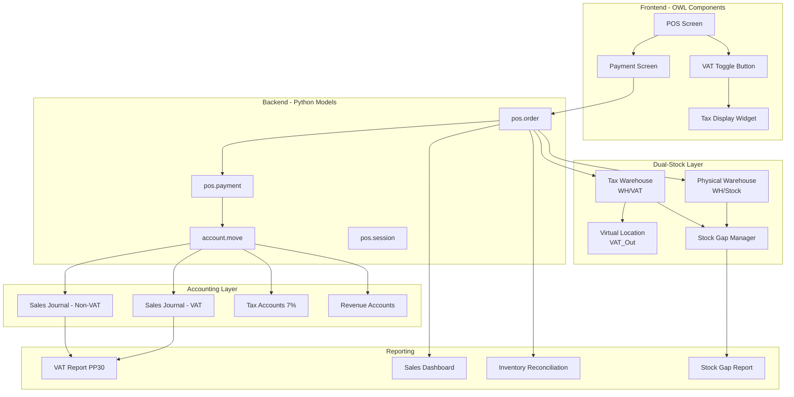
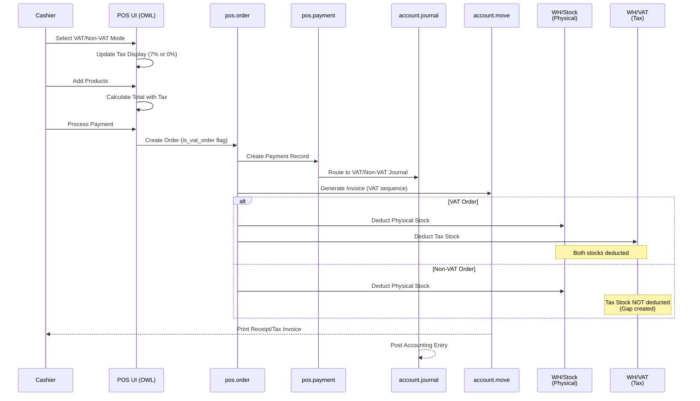

# Design Document: POS VAT/Non-VAT Management System

## Overview

This design specifies an Odoo 18 Point of Sale (POS) module for a Thai construction materials store that enables dual-mode sales processing: VAT-registered sales (7% VAT) for business customers requiring tax invoices, and Non-VAT sales for walk-in cash customers. The system ensures compliance with Thai Revenue Department regulations by maintaining separate accounting journals, proper tax invoice sequences, and unified inventory tracking across both sales modes. Built on Odoo 18's OWL framework, the solution provides real-time VAT/Non-VAT mode switching in the POS interface while automatically routing transactions to appropriate journals and generating compliant documentation for monthly ภ.พ.30 (PP30) tax filing.

## Architecture

The system follows Odoo's MVC architecture with custom extensions to the POS module, integrating backend Python models with OWL-based frontend components, accounting subsystems, and a **Dual-Stock Architecture** for Physical and Tax inventory management.

### Dual-Stock Architecture Overview

The system implements two logical inventory layers to satisfy both operational and tax compliance requirements:

1. **Physical Warehouse (WH/Stock)**: Tracks actual inventory for all sales (VAT and Non-VAT) - used for operational management, purchasing decisions, and real stock levels
2. **Tax Warehouse (WH/VAT)**: Tracks inventory for tax reporting purposes - only deducted for VAT sales, used for Thai Revenue Department compliance



## Main Workflow

### Dual-Stock Processing Flow



## Components and Interfaces

### Component 1: POS Order Model Extension (pos.order)

**Purpose**: Extends the core POS order model to track VAT/Non-VAT mode, route transactions to appropriate journals, and manage dual-stock deductions.

**Interface**:
```python
class PosOrder(models.Model):
    _inherit = 'pos.order'
    
    is_vat_order = fields.Boolean(
        string='VAT Order',
        default=True,
        help='True if order requires VAT tax invoice'
    )
    
    vat_journal_id = fields.Many2one(
        'account.journal',
        string='VAT Journal',
        compute='_compute_vat_journal'
    )
    
    physical_stock_move_ids = fields.One2many(
        'stock.move',
        'pos_order_id',
        string='Physical Stock Moves',
        domain=[('location_id.usage', '=', 'internal')],
        help='Stock moves from Physical Warehouse (WH/Stock)'
    )
    
    tax_stock_move_ids = fields.One2many(
        'stock.move',
        'pos_order_id',
        string='Tax Stock Moves',
        domain=[('location_id.name', '=', 'WH/VAT')],
        help='Stock moves from Tax Warehouse (WH/VAT) - VAT orders only'
    )
    
    def _compute_vat_journal(self) -> None:
        """Compute appropriate journal based on VAT mode"""
        pass
    
    def _prepare_invoice_vals(self) -> dict:
        """Override to use VAT-specific invoice sequence"""
        pass
    
    def _create_account_move(self, balancing_account=False, amount_to_balance=0, bank_payment_method_diffs=None) -> 'account.move':
        """Override to route to correct journal"""
        pass
    
    def _create_order_picking(self) -> 'stock.picking':
        """Override to create dual-stock moves"""
        pass
    
    def _trigger_vat_stock_move(self) -> list:
        """Create stock moves from Tax Warehouse for VAT orders"""
        pass
```

**Responsibilities**:
- Track VAT/Non-VAT mode for each order
- Compute appropriate journal based on order type
- Override invoice generation to use correct sequence
- Route accounting entries to correct journal
- Create physical stock moves for ALL orders (WH/Stock → Customers)
- Create tax stock moves ONLY for VAT orders (WH/VAT → Virtual/VAT_Out)
- Maintain dual-stock tracking for inventory reconciliation

### Component 2: POS Payment Extension (pos.payment)

**Purpose**: Extends payment processing to ensure payments are recorded in the correct journal.

**Interface**:
```python
class PosPayment(models.Model):
    _inherit = 'pos.payment'
    
    is_vat_payment = fields.Boolean(
        string='VAT Payment',
        related='pos_order_id.is_vat_order',
        store=True
    )
    
    def _create_payment_moves(self) -> list:
        """Override to use VAT-aware journal selection"""
        pass
```

**Responsibilities**:
- Link payment to order's VAT mode
- Route payment entries to correct journal
- Maintain payment reconciliation across journals

### Component 3: POS Session Extension (pos.session)

**Purpose**: Extends POS session to handle dual-journal closing and reconciliation.

**Interface**:
```python
class PosSession(models.Model):
    _inherit = 'pos.session'
    
    vat_sales_total = fields.Monetary(
        string='VAT Sales Total',
        compute='_compute_vat_totals'
    )
    
    non_vat_sales_total = fields.Monetary(
        string='Non-VAT Sales Total',
        compute='_compute_vat_totals'
    )
    
    def _compute_vat_totals(self) -> None:
        """Compute separate totals for VAT and Non-VAT sales"""
        pass
    
    def _validate_session(self, balancing_account=False, amount_to_balance=0, bank_payment_method_diffs=None) -> None:
        """Override to validate both journal entries"""
        pass
```

**Responsibilities**:
- Track separate totals for VAT and Non-VAT sales
- Validate session closing with dual journals
- Generate session reports with VAT breakdown

### Component 4: VAT Toggle Button (OWL Component)

**Purpose**: Frontend component providing VAT/Non-VAT mode switching in POS interface.

**Interface**:
```javascript
/** @odoo-module **/
import { Component } from "@odoo/owl";
import { usePos } from "@point_of_sale/app/store/pos_hook";

export class VatToggleButton extends Component {
    static template = "pos_vat_management.VatToggleButton";
    
    setup() {
        this.pos = usePos();
    }
    
    get isVatMode() {
        return this.pos.get_order()?.is_vat_order ?? true;
    }
    
    toggleVatMode() {
        const order = this.pos.get_order();
        if (order) {
            order.is_vat_order = !order.is_vat_order;
            order.trigger('change');
        }
    }
}
```

**Responsibilities**:
- Display current VAT mode status
- Toggle between VAT and Non-VAT modes
- Trigger order recalculation on mode change
- Provide visual feedback of current mode

### Component 5: Tax Display Widget (OWL Component)

**Purpose**: Real-time display of tax calculations based on current VAT mode.

**Interface**:
```javascript
/** @odoo-module **/
import { Component } from "@odoo/owl";
import { usePos } from "@point_of_sale/app/store/pos_hook";

export class TaxDisplayWidget extends Component {
    static template = "pos_vat_management.TaxDisplayWidget";
    
    setup() {
        this.pos = usePos();
    }
    
    get taxAmount() {
        const order = this.pos.get_order();
        return order ? order.get_total_tax() : 0;
    }
    
    get taxRate() {
        const order = this.pos.get_order();
        return order?.is_vat_order ? 7 : 0;
    }
}
```

**Responsibilities**:
- Display current tax rate (7% or 0%)
- Show calculated tax amount
- Update in real-time when mode changes
- Highlight VAT mode visually

### Component 6: Account Journal Configuration

**Purpose**: Separate journals for VAT and Non-VAT sales with proper account mapping.

**Interface**:
```python
class AccountJournal(models.Model):
    _inherit = 'account.journal'
    
    is_vat_journal = fields.Boolean(
        string='VAT Journal',
        help='Journal for VAT-registered sales'
    )
    
    is_non_vat_journal = fields.Boolean(
        string='Non-VAT Journal',
        help='Journal for Non-VAT sales'
    )
```

**Responsibilities**:
- Separate VAT and Non-VAT sales entries
- Maintain proper account codes for reporting
- Support Thai Revenue Department audit requirements

### Component 7: VAT Report Generator (PP30)

**Purpose**: Generate Thai Revenue Department PP30 tax report from VAT sales data.

**Interface**:
```python
class VatReportPP30(models.TransientModel):
    _name = 'vat.report.pp30'
    _description = 'Thai VAT Report PP30'
    
    date_from = fields.Date(string='From Date', required=True)
    date_to = fields.Date(string='To Date', required=True)
    
    def generate_report(self) -> dict:
        """Generate PP30 report for specified period"""
        pass
    
    def _get_vat_sales(self) -> list:
        """Retrieve VAT sales for period"""
        pass
    
    def _compute_vat_summary(self) -> dict:
        """Compute VAT summary totals"""
        pass
```

**Responsibilities**:
- Filter VAT sales by date range
- Calculate total VAT collected
- Generate PP30-compliant report format
- Export report for tax filing

### Component 8: Stock Gap Manager (Dual-Stock Reconciliation)

**Purpose**: Manage the "gap" between Physical Stock and Tax Stock created by Non-VAT sales, providing tools to reconcile Tax Stock with actual usage.

**Interface**:
```python
class StockGapManager(models.TransientModel):
    _name = 'stock.gap.manager'
    _description = 'Dual-Stock Gap Management'
    
    date_from = fields.Date(string='From Date', required=True)
    date_to = fields.Date(string='To Date', required=True)
    
    gap_line_ids = fields.One2many(
        'stock.gap.line',
        'manager_id',
        string='Stock Gap Lines'
    )
    
    def compute_stock_gaps(self) -> None:
        """Calculate gaps between Physical and Tax stock"""
        pass
    
    def create_adjustment_moves(self) -> list:
        """Create stock moves to reconcile Tax Stock"""
        pass
    
    def generate_gap_report(self) -> dict:
        """Generate report showing stock gaps by product"""
        pass


class StockGapLine(models.TransientModel):
    _name = 'stock.gap.line'
    _description = 'Stock Gap Line'
    
    manager_id = fields.Many2one('stock.gap.manager', required=True)
    product_id = fields.Many2one('product.product', string='Product', required=True)
    
    physical_qty = fields.Float(string='Physical Stock Sold', help='Quantity sold from WH/Stock')
    tax_qty = fields.Float(string='Tax Stock Sold', help='Quantity sold from WH/VAT (VAT orders only)')
    gap_qty = fields.Float(string='Gap Quantity', compute='_compute_gap_qty', help='Difference (Non-VAT sales)')
    
    adjustment_reason = fields.Selection([
        ('usage', 'Internal Usage / Withdrawal'),
        ('damaged', 'Damaged / Defective'),
        ('lost', 'Lost / Missing'),
        ('disposal', 'Disposal / Write-off'),
        ('sample', 'Sample / Demo')
    ], string='Adjustment Reason', required=True)
    
    def _compute_gap_qty(self) -> None:
        """Compute gap quantity (physical - tax)"""
        pass
    
    def create_tax_stock_adjustment(self) -> 'stock.move':
        """Create adjustment move from WH/VAT to Virtual location"""
        pass
```

**Responsibilities**:
- Calculate stock gaps between Physical and Tax warehouses
- Identify products with Non-VAT sales (gap > 0)
- Provide reason codes for Tax Stock adjustments
- Create Internal Transfers from WH/VAT to Virtual/Usage or Virtual/VAT_Out
- Generate audit trail for all Tax Stock adjustments
- Support batch processing for end-of-period reconciliation
- Ensure Tax Stock never shows negative or inflated values for tax reporting

### Component 9: Stock Location Configuration

**Purpose**: Configure dual-warehouse structure with Physical and Tax locations.

**Interface**:
```python
class StockLocation(models.Model):
    _inherit = 'stock.location'
    
    is_physical_warehouse = fields.Boolean(
        string='Physical Warehouse',
        help='Main warehouse for operational stock tracking'
    )
    
    is_tax_warehouse = fields.Boolean(
        string='Tax Warehouse',
        help='Warehouse for tax reporting (VAT sales only)'
    )
    
    is_vat_virtual_location = fields.Boolean(
        string='VAT Virtual Location',
        help='Virtual location for Tax Stock adjustments'
    )
```

**Responsibilities**:
- Mark WH/Stock as Physical Warehouse
- Mark WH/VAT as Tax Warehouse
- Create Virtual/VAT_Out and Virtual/Usage locations
- Prevent manual stock moves between Physical and Tax warehouses

## Data Models

### Model 1: POS Order Extension

```python
class PosOrder(models.Model):
    _inherit = 'pos.order'
    
    is_vat_order = fields.Boolean(
        string='VAT Order',
        default=True,
        help='Indicates if order requires VAT tax invoice'
    )
    
    vat_journal_id = fields.Many2one(
        'account.journal',
        string='VAT Journal',
        compute='_compute_vat_journal',
        store=True
    )
    
    invoice_sequence_type = fields.Selection([
        ('vat', 'VAT Invoice'),
        ('non_vat', 'Non-VAT Receipt')
    ], compute='_compute_invoice_sequence_type', store=True)
```


**Validation Rules**:
- is_vat_order must be set before payment processing
- vat_journal_id must exist and be active
- VAT orders must have valid tax configuration (7%)
- Non-VAT orders must have 0% tax
- All orders must deduct inventory regardless of VAT mode

### Model 2: POS Config Extension

```python
class PosConfig(models.Model):
    _inherit = 'pos.config'
    
    vat_journal_id = fields.Many2one(
        'account.journal',
        string='VAT Sales Journal',
        domain="[('type', '=', 'sale'), ('is_vat_journal', '=', True)]",
        required=True
    )
    
    non_vat_journal_id = fields.Many2one(
        'account.journal',
        string='Non-VAT Sales Journal',
        domain="[('type', '=', 'sale'), ('is_non_vat_journal', '=', True)]",
        required=True
    )
    
    vat_tax_id = fields.Many2one(
        'account.tax',
        string='VAT Tax (7%)',
        domain="[('type_tax_use', '=', 'sale'), ('amount', '=', 7)]"
    )
```

**Validation Rules**:
- vat_journal_id and non_vat_journal_id must be different
- Both journals must be of type 'sale'
- vat_tax_id must be 7% sales tax
- Journals must be configured before POS session start


### Model 3: Account Move Extension

```python
class AccountMove(models.Model):
    _inherit = 'account.move'
    
    is_vat_invoice = fields.Boolean(
        string='VAT Invoice',
        compute='_compute_is_vat_invoice',
        store=True
    )
    
    pos_vat_order_id = fields.Many2one(
        'pos.order',
        string='Related POS VAT Order',
        compute='_compute_pos_vat_order'
    )
```

**Validation Rules**:
- VAT invoices must use VAT journal
- Non-VAT invoices must use Non-VAT journal
- Invoice sequence must match journal type
- Tax lines must match order VAT mode

### Model 4: Stock Move Extension (Dual-Stock Tracking)

```python
class StockMove(models.Model):
    _inherit = 'stock.move'
    
    is_physical_stock_move = fields.Boolean(
        string='Physical Stock Move',
        compute='_compute_stock_type',
        store=True,
        help='Move from Physical Warehouse (WH/Stock)'
    )
    
    is_tax_stock_move = fields.Boolean(
        string='Tax Stock Move',
        compute='_compute_stock_type',
        store=True,
        help='Move from Tax Warehouse (WH/VAT)'
    )
    
    pos_order_id = fields.Many2one(
        'pos.order',
        string='Related POS Order',
        help='Link to originating POS order'
    )
    
    stock_gap_reason = fields.Selection([
        ('usage', 'Internal Usage / Withdrawal'),
        ('damaged', 'Damaged / Defective'),
        ('lost', 'Lost / Missing'),
        ('disposal', 'Disposal / Write-off'),
        ('sample', 'Sample / Demo')
    ], string='Gap Adjustment Reason', help='Reason for Tax Stock adjustment')
    
    def _compute_stock_type(self) -> None:
        """Determine if move is from Physical or Tax warehouse"""
        pass
```

**Validation Rules**:
- All POS orders must create physical_stock_move (from WH/Stock)
- Only VAT orders create tax_stock_move (from WH/VAT)
- Tax Stock adjustments must have stock_gap_reason set
- Physical Stock moves cannot have negative quantities
- Tax Stock cannot exceed Physical Stock for same product

### Model 5: Stock Gap History

```python
class StockGapHistory(models.Model):
    _name = 'stock.gap.history'
    _description = 'Stock Gap Adjustment History'
    _order = 'adjustment_date desc'
    
    adjustment_date = fields.Datetime(
        string='Adjustment Date',
        default=fields.Datetime.now,
        required=True
    )
    
    product_id = fields.Many2one(
        'product.product',
        string='Product',
        required=True
    )
    
    gap_qty = fields.Float(
        string='Gap Quantity',
        required=True,
        help='Quantity of Non-VAT sales to adjust'
    )
    
    adjustment_reason = fields.Selection([
        ('usage', 'Internal Usage / Withdrawal'),
        ('damaged', 'Damaged / Defective'),
        ('lost', 'Lost / Missing'),
        ('disposal', 'Disposal / Write-off'),
        ('sample', 'Sample / Demo')
    ], string='Reason', required=True)
    
    stock_move_id = fields.Many2one(
        'stock.move',
        string='Adjustment Move',
        help='Stock move created for this adjustment'
    )
    
    user_id = fields.Many2one(
        'res.users',
        string='Adjusted By',
        default=lambda self: self.env.user,
        required=True
    )
    
    notes = fields.Text(string='Notes')
    
    state = fields.Selection([
        ('draft', 'Draft'),
        ('done', 'Done'),
        ('cancelled', 'Cancelled')
    ], default='draft', required=True)
```

**Validation Rules**:
- gap_qty must be positive
- adjustment_reason must be set
- Adjustment must create corresponding stock.move
- Cannot delete history records (audit trail)
- state must be 'done' before stock move is posted

## Key Functions with Formal Specifications

### Function 1: _compute_vat_journal()

```python
def _compute_vat_journal(self) -> None:
    """Compute appropriate journal based on VAT mode"""
    pass
```

**Preconditions:**
- self is a valid pos.order record
- self.config_id exists and has vat_journal_id and non_vat_journal_id configured
- self.is_vat_order is set (boolean value)

**Postconditions:**
- self.vat_journal_id is set to appropriate journal
- If is_vat_order is True, vat_journal_id = config_id.vat_journal_id
- If is_vat_order is False, vat_journal_id = config_id.non_vat_journal_id
- vat_journal_id is never None after execution

**Loop Invariants:** N/A (no loops)


### Function 2: _prepare_invoice_vals()

```python
def _prepare_invoice_vals(self) -> dict:
    """Override to use VAT-specific invoice sequence and journal"""
    pass
```

**Preconditions:**
- self is a valid pos.order record
- self.is_vat_order is set
- self.vat_journal_id is computed and valid
- self.partner_id exists (customer)
- self.lines contains at least one order line

**Postconditions:**
- Returns dictionary with invoice values
- 'journal_id' key contains correct journal based on VAT mode
- 'move_type' is 'out_invoice'
- If is_vat_order is True, uses VAT invoice sequence
- If is_vat_order is False, uses Non-VAT receipt sequence
- All required invoice fields are present in returned dict

**Loop Invariants:** N/A (no loops)

### Function 3: _create_account_move()

```python
def _create_account_move(self, balancing_account=False, amount_to_balance=0, bank_payment_method_diffs=None) -> 'account.move':
    """Override to route to correct journal and create proper accounting entries"""
    pass
```

**Preconditions:**
- self is a valid pos.order record in 'paid' or 'done' state
- self.vat_journal_id is set and valid
- self.amount_total > 0
- All order lines have valid product and price data
- Tax configuration is valid for current VAT mode

**Postconditions:**
- Returns created account.move record
- account.move.journal_id matches self.vat_journal_id
- account.move is in 'posted' state
- Inventory moves are created for all order lines
- Tax lines are created correctly (7% for VAT, 0% for Non-VAT)
- Accounting entries balance (debits = credits)

**Loop Invariants:** 
- For order line processing: All previously processed lines have valid move lines created
- Running total of debits equals running total of credits


### Function 4: _validate_session()

```python
def _validate_session(self, balancing_account=False, amount_to_balance=0, bank_payment_method_diffs=None) -> None:
    """Override to validate both VAT and Non-VAT journal entries"""
    pass
```

**Preconditions:**
- self is a valid pos.session record
- self.state is 'closing_control'
- All orders in session are in 'paid' or 'done' state
- Both vat_journal_id and non_vat_journal_id are configured
- Cash differences are reconciled

**Postconditions:**
- self.state is 'closed'
- All VAT orders have posted account moves in VAT journal
- All Non-VAT orders have posted account moves in Non-VAT journal
- Session totals match sum of order totals
- Bank statement is created and reconciled
- No unposted accounting entries remain

**Loop Invariants:**
- For order validation loop: All previously validated orders have posted moves
- Running session total matches sum of validated order totals

### Function 5: generate_vat_report()

```python
def generate_vat_report(self) -> dict:
    """Generate PP30 VAT report for specified period"""
    pass
```

**Preconditions:**
- self is a valid vat.report.pp30 wizard record
- self.date_from <= self.date_to
- date_from and date_to are valid dates
- At least one VAT journal exists in system

**Postconditions:**
- Returns dictionary with report data
- Report contains all VAT sales in date range
- Total VAT amount is correctly calculated (sum of all VAT)
- Total sales amount excludes VAT (base amount)
- Report format complies with Thai PP30 requirements
- Non-VAT sales are excluded from report

**Loop Invariants:**
- For sales aggregation loop: Running VAT total equals sum of processed order VAT amounts
- All processed orders have is_vat_order = True

### Function 6: _create_order_picking()

```python
def _create_order_picking(self) -> 'stock.picking':
    """Override to create dual-stock moves (Physical + Tax)"""
    pass
```

**Preconditions:**
- self is a valid pos.order record in 'paid' state
- self.lines contains at least one order line with product
- All products have sufficient stock in WH/Stock
- If is_vat_order=True, products have sufficient stock in WH/VAT
- self.config_id has physical_location_id and tax_location_id configured

**Postconditions:**
- Returns created stock.picking record
- Physical stock moves created for ALL orders (WH/Stock → Customers)
- If is_vat_order=True, tax stock moves created (WH/VAT → Virtual/VAT_Out)
- If is_vat_order=False, NO tax stock moves created (gap created)
- All stock moves are in 'done' state
- Inventory quantities updated correctly

**Loop Invariants:**
- For order line processing: All processed lines have physical stock moves created
- For VAT orders: All processed lines have both physical and tax stock moves

### Function 7: _trigger_vat_stock_move()

```python
def _trigger_vat_stock_move(self) -> list:
    """Create stock moves from Tax Warehouse for VAT orders"""
    pass
```

**Preconditions:**
- self is a valid pos.order record
- self.is_vat_order = True
- self.state = 'paid'
- self.lines contains at least one order line
- Tax Warehouse (WH/VAT) exists and is configured
- Virtual/VAT_Out location exists

**Postconditions:**
- Returns list of created stock.move records
- One stock move created per order line
- All moves are from WH/VAT to Virtual/VAT_Out
- All moves have is_tax_stock_move = True
- All moves are linked to self via pos_order_id
- All moves are in 'done' state
- Tax Stock quantities are deducted

**Loop Invariants:**
- For each order line: Corresponding tax stock move is created
- Running total of tax stock moves equals number of order lines processed

### Function 8: compute_stock_gaps()

```python
def compute_stock_gaps(self) -> None:
    """Calculate gaps between Physical and Tax stock for period"""
    pass
```

**Preconditions:**
- self is a valid stock.gap.manager wizard record
- self.date_from <= self.date_to
- Physical Warehouse (WH/Stock) exists
- Tax Warehouse (WH/VAT) exists
- At least one POS order exists in date range

**Postconditions:**
- self.gap_line_ids contains one line per product with gaps
- Each gap line shows physical_qty, tax_qty, and gap_qty
- gap_qty = physical_qty - tax_qty (Non-VAT sales quantity)
- Only products with gap_qty > 0 are included
- Lines are sorted by gap_qty descending

**Loop Invariants:**
- For product aggregation: Running gap total equals sum of Non-VAT sales
- All processed products have valid physical and tax quantities

### Function 9: create_adjustment_moves()

```python
def create_adjustment_moves(self) -> list:
    """Create stock moves to reconcile Tax Stock with reasons"""
    pass
```

**Preconditions:**
- self is a valid stock.gap.manager wizard record
- self.gap_line_ids is not empty
- All gap lines have adjustment_reason set
- All gap lines have gap_qty > 0
- Tax Warehouse (WH/VAT) has sufficient stock for adjustments

**Postconditions:**
- Returns list of created stock.move records
- One stock move created per gap line
- All moves are from WH/VAT to appropriate Virtual location based on reason
- All moves have stock_gap_reason set
- All moves are in 'done' state
- Stock gap history records created for audit trail
- Tax Stock quantities match Physical Stock after adjustment

**Loop Invariants:**
- For gap line processing: All processed lines have adjustment moves created
- Running total of adjustment quantities equals total gap quantity


## Algorithmic Pseudocode

### Main Processing Algorithm: POS Order Creation with VAT Mode

```pascal
ALGORITHM processOrderWithVatMode(orderData, isVatMode)
INPUT: orderData (order lines, customer, payment), isVatMode (boolean)
OUTPUT: createdOrder of type pos.order

BEGIN
  ASSERT orderData.lines IS NOT EMPTY
  ASSERT orderData.payment_amount > 0
  
  // Step 1: Create order with VAT flag
  order ← createOrder(orderData)
  order.is_vat_order ← isVatMode
  
  // Step 2: Compute appropriate journal
  IF isVatMode = TRUE THEN
    order.vat_journal_id ← order.config_id.vat_journal_id
    taxRate ← 7.0
  ELSE
    order.vat_journal_id ← order.config_id.non_vat_journal_id
    taxRate ← 0.0
  END IF
  
  ASSERT order.vat_journal_id IS NOT NULL
  
  // Step 3: Apply tax to order lines
  FOR each line IN order.lines DO
    ASSERT line.product_id IS NOT NULL
    ASSERT line.qty > 0
    
    line.tax_ids ← getTaxForRate(taxRate)
    line.price_subtotal_incl ← line.price_unit * line.qty * (1 + taxRate/100)
  END FOR
  
  // Step 4: Process payment and create accounting entries
  payment ← createPayment(order, orderData.payment_amount)
  accountMove ← createAccountMove(order)
  
  ASSERT accountMove.journal_id = order.vat_journal_id
  ASSERT accountMove.state = 'posted'
  
  // Step 5: Deduct inventory (both VAT and Non-VAT)
  FOR each line IN order.lines DO
    createStockMove(line.product_id, line.qty, order.location_id)
  END FOR
  
  order.state ← 'paid'
  
  ASSERT order.amount_total > 0
  ASSERT order.state = 'paid'
  
  RETURN order
END
```

**Preconditions:**
- orderData contains valid order lines with products and quantities
- orderData.payment_amount matches calculated order total
- isVatMode is a boolean value
- POS config has both VAT and Non-VAT journals configured

**Postconditions:**
- Order is created with correct VAT mode flag
- Order is routed to appropriate journal
- Tax is applied correctly (7% or 0%)
- Inventory is deducted for all products
- Accounting entries are posted
- Order state is 'paid'

**Loop Invariants:**
- Tax application loop: All processed lines have correct tax_ids set
- Inventory deduction loop: All processed lines have stock moves created


### Session Closing Algorithm with Dual Journals

```pascal
ALGORITHM closeSessionWithDualJournals(session)
INPUT: session of type pos.session
OUTPUT: closedSession with validated entries

BEGIN
  ASSERT session.state = 'closing_control'
  ASSERT session.order_ids IS NOT EMPTY
  
  // Step 1: Separate orders by VAT mode
  vatOrders ← []
  nonVatOrders ← []
  
  FOR each order IN session.order_ids DO
    ASSERT order.state IN ['paid', 'done', 'invoiced']
    
    IF order.is_vat_order = TRUE THEN
      vatOrders.append(order)
    ELSE
      nonVatOrders.append(order)
    END IF
  END FOR
  
  // Step 2: Validate VAT journal entries
  vatTotal ← 0
  FOR each order IN vatOrders DO
    ASSERT order.account_move.journal_id = session.config_id.vat_journal_id
    ASSERT order.account_move.state = 'posted'
    vatTotal ← vatTotal + order.amount_total
  END FOR
  
  // Step 3: Validate Non-VAT journal entries
  nonVatTotal ← 0
  FOR each order IN nonVatOrders DO
    ASSERT order.account_move.journal_id = session.config_id.non_vat_journal_id
    ASSERT order.account_move.state = 'posted'
    nonVatTotal ← nonVatTotal + order.amount_total
  END FOR
  
  // Step 4: Reconcile session totals
  sessionTotal ← vatTotal + nonVatTotal
  ASSERT sessionTotal = session.cash_register_balance_end_real
  
  // Step 5: Create bank statement
  bankStatement ← createBankStatement(session, sessionTotal)
  bankStatement.state ← 'confirm'
  
  // Step 6: Close session
  session.state ← 'closed'
  session.vat_sales_total ← vatTotal
  session.non_vat_sales_total ← nonVatTotal
  
  ASSERT session.state = 'closed'
  ASSERT session.vat_sales_total + session.non_vat_sales_total = sessionTotal
  
  RETURN session
END
```

**Preconditions:**
- session.state is 'closing_control'
- All orders in session are paid/done/invoiced
- All orders have posted account moves
- Cash register balance is entered

**Postconditions:**
- session.state is 'closed'
- All VAT orders validated in VAT journal
- All Non-VAT orders validated in Non-VAT journal
- Session totals match order totals
- Bank statement created and confirmed

**Loop Invariants:**
- Order separation loop: All processed orders are correctly categorized
- VAT validation loop: Running vatTotal equals sum of validated VAT orders
- Non-VAT validation loop: Running nonVatTotal equals sum of validated Non-VAT orders


### VAT Report Generation Algorithm (PP30)

```pascal
ALGORITHM generatePP30Report(dateFrom, dateTo)
INPUT: dateFrom (date), dateTo (date)
OUTPUT: reportData (dictionary with VAT summary)

BEGIN
  ASSERT dateFrom <= dateTo
  ASSERT dateFrom IS NOT NULL AND dateTo IS NOT NULL
  
  // Step 1: Retrieve all VAT orders in period
  vatOrders ← []
  allOrders ← searchOrders(date_order >= dateFrom AND date_order <= dateTo)
  
  FOR each order IN allOrders DO
    IF order.is_vat_order = TRUE AND order.state IN ['paid', 'done', 'invoiced'] THEN
      vatOrders.append(order)
    END IF
  END FOR
  
  // Step 2: Calculate VAT summary
  totalSalesBase ← 0
  totalVatAmount ← 0
  orderCount ← 0
  
  FOR each order IN vatOrders DO
    ASSERT order.amount_total > 0
    ASSERT order.amount_tax >= 0
    
    baseAmount ← order.amount_total - order.amount_tax
    vatAmount ← order.amount_tax
    
    totalSalesBase ← totalSalesBase + baseAmount
    totalVatAmount ← totalVatAmount + vatAmount
    orderCount ← orderCount + 1
  END FOR
  
  // Step 3: Verify VAT calculation (7% rate)
  expectedVat ← totalSalesBase * 0.07
  ASSERT ABS(totalVatAmount - expectedVat) < 0.01  // Allow rounding difference
  
  // Step 4: Build report data
  reportData ← {
    'period_from': dateFrom,
    'period_to': dateTo,
    'total_sales_base': totalSalesBase,
    'total_vat_amount': totalVatAmount,
    'total_sales_including_vat': totalSalesBase + totalVatAmount,
    'order_count': orderCount,
    'vat_rate': 7.0,
    'report_type': 'PP30'
  }
  
  ASSERT reportData.total_vat_amount > 0 OR orderCount = 0
  ASSERT reportData.total_sales_base >= 0
  
  RETURN reportData
END
```

**Preconditions:**
- dateFrom and dateTo are valid dates
- dateFrom <= dateTo
- VAT journal exists and contains orders
- All VAT orders have correct tax configuration (7%)

**Postconditions:**
- Report contains all VAT orders in date range
- Total VAT amount is correctly calculated
- Base amount excludes VAT
- Report format complies with PP30 requirements
- Non-VAT orders are excluded

**Loop Invariants:**
- Order filtering loop: All processed orders with is_vat_order=True are included
- Summary calculation loop: Running totals match sum of processed orders
- All processed orders have valid tax amounts

### Dual-Stock Creation Algorithm

```pascal
ALGORITHM createDualStockMoves(order)
INPUT: order of type pos.order (in 'paid' state)
OUTPUT: stockMoves (list of created stock.move records)

BEGIN
  ASSERT order.state = 'paid'
  ASSERT order.lines IS NOT EMPTY
  ASSERT order.config_id.physical_location_id IS NOT NULL
  ASSERT order.config_id.tax_location_id IS NOT NULL
  
  stockMoves ← []
  physicalLocation ← order.config_id.physical_location_id  // WH/Stock
  taxLocation ← order.config_id.tax_location_id            // WH/VAT
  customerLocation ← getCustomerLocation()
  virtualVatOut ← getVirtualLocation('VAT_Out')
  
  // Step 1: Create Physical Stock Moves (ALL orders)
  FOR each line IN order.lines DO
    ASSERT line.product_id IS NOT NULL
    ASSERT line.qty > 0
    ASSERT line.product_id.qty_available >= line.qty  // Check stock
    
    physicalMove ← createStockMove({
      'product_id': line.product_id,
      'product_uom_qty': line.qty,
      'location_id': physicalLocation,
      'location_dest_id': customerLocation,
      'pos_order_id': order.id,
      'is_physical_stock_move': TRUE,
      'name': 'POS Physical: ' + order.name
    })
    
    physicalMove.state ← 'done'
    stockMoves.append(physicalMove)
  END FOR
  
  // Step 2: Create Tax Stock Moves (VAT orders ONLY)
  IF order.is_vat_order = TRUE THEN
    FOR each line IN order.lines DO
      ASSERT line.product_id.qty_available_in_tax_warehouse >= line.qty
      
      taxMove ← createStockMove({
        'product_id': line.product_id,
        'product_uom_qty': line.qty,
        'location_id': taxLocation,
        'location_dest_id': virtualVatOut,
        'pos_order_id': order.id,
        'is_tax_stock_move': TRUE,
        'name': 'POS Tax: ' + order.name
      })
      
      taxMove.state ← 'done'
      stockMoves.append(taxMove)
    END FOR
  ELSE
    // Non-VAT order: No Tax Stock moves created
    // This creates the "gap" that needs reconciliation
    logStockGap(order, 'Non-VAT sale - Tax Stock not deducted')
  END IF
  
  ASSERT stockMoves IS NOT EMPTY
  ASSERT ALL(move.state = 'done' FOR move IN stockMoves)
  
  RETURN stockMoves
END
```

**Preconditions:**
- order is in 'paid' state
- order.lines contains valid products with quantities
- Physical and Tax locations are configured
- Sufficient stock exists in both warehouses

**Postconditions:**
- Physical stock moves created for all order lines
- Tax stock moves created only if is_vat_order=True
- All moves are in 'done' state
- Stock quantities updated correctly
- Gap logged for Non-VAT orders

**Loop Invariants:**
- Physical move loop: All processed lines have physical moves created
- Tax move loop (VAT only): All processed lines have tax moves created
- All created moves are valid and linked to order

### Stock Gap Reconciliation Algorithm

```pascal
ALGORITHM reconcileStockGaps(dateFrom, dateTo)
INPUT: dateFrom (date), dateTo (date)
OUTPUT: adjustmentMoves (list of stock adjustment moves)

BEGIN
  ASSERT dateFrom <= dateTo
  
  // Step 1: Calculate gaps by product
  productGaps ← {}  // Dictionary: product_id -> gap_quantity
  
  allOrders ← searchOrders(date_order >= dateFrom AND date_order <= dateTo)
  
  FOR each order IN allOrders DO
    FOR each line IN order.lines DO
      productId ← line.product_id.id
      
      IF productId NOT IN productGaps THEN
        productGaps[productId] ← {
          'physical_qty': 0,
          'tax_qty': 0,
          'gap_qty': 0,
          'product': line.product_id
        }
      END IF
      
      // Count physical sales (all orders)
      productGaps[productId].physical_qty ← productGaps[productId].physical_qty + line.qty
      
      // Count tax sales (VAT orders only)
      IF order.is_vat_order = TRUE THEN
        productGaps[productId].tax_qty ← productGaps[productId].tax_qty + line.qty
      END IF
    END FOR
  END FOR
  
  // Step 2: Calculate gap quantities
  FOR each productId IN productGaps DO
    gap ← productGaps[productId]
    gap.gap_qty ← gap.physical_qty - gap.tax_qty
    
    ASSERT gap.gap_qty >= 0  // Tax sales cannot exceed physical sales
  END FOR
  
  // Step 3: Create adjustment moves for gaps
  adjustmentMoves ← []
  taxLocation ← getTaxWarehouse()  // WH/VAT
  
  FOR each productId IN productGaps DO
    gap ← productGaps[productId]
    
    IF gap.gap_qty > 0 THEN
      // Prompt user for adjustment reason
      reason ← getUserAdjustmentReason(gap.product, gap.gap_qty)
      
      // Determine destination based on reason
      IF reason = 'usage' THEN
        destLocation ← getVirtualLocation('Usage')
      ELSE IF reason IN ['damaged', 'lost', 'disposal'] THEN
        destLocation ← getVirtualLocation('Scrap')
      ELSE IF reason = 'sample' THEN
        destLocation ← getVirtualLocation('Sample')
      ELSE
        destLocation ← getVirtualLocation('VAT_Out')
      END IF
      
      // Create adjustment move
      adjustmentMove ← createStockMove({
        'product_id': gap.product,
        'product_uom_qty': gap.gap_qty,
        'location_id': taxLocation,
        'location_dest_id': destLocation,
        'stock_gap_reason': reason,
        'name': 'Tax Stock Adjustment: ' + reason
      })
      
      adjustmentMove.state ← 'done'
      adjustmentMoves.append(adjustmentMove)
      
      // Create audit history
      createStockGapHistory({
        'product_id': gap.product,
        'gap_qty': gap.gap_qty,
        'adjustment_reason': reason,
        'stock_move_id': adjustmentMove.id,
        'adjustment_date': NOW()
      })
    END IF
  END FOR
  
  ASSERT ALL(move.state = 'done' FOR move IN adjustmentMoves)
  
  RETURN adjustmentMoves
END
```

**Preconditions:**
- dateFrom <= dateTo
- Physical and Tax warehouses exist
- Virtual locations for adjustments exist
- At least one order exists in period

**Postconditions:**
- All stock gaps calculated correctly
- Adjustment moves created for all gaps > 0
- All adjustments have valid reasons
- Audit history created for all adjustments
- Tax Stock reconciled with Physical Stock

**Loop Invariants:**
- Gap calculation loop: Running totals match order quantities
- Adjustment creation loop: All gaps > 0 have adjustment moves
- All adjustments have valid reasons and destinations


## Example Usage

### Example 1: Creating VAT Order in POS

```python
# Frontend (OWL) - User toggles VAT mode
const order = this.pos.get_order();
order.is_vat_order = true;  // Enable VAT mode
order.trigger('change');

# Backend - Order processing
order_data = {
    'lines': [
        {'product_id': cement_product.id, 'qty': 10, 'price_unit': 100.0},
        {'product_id': steel_product.id, 'qty': 5, 'price_unit': 500.0}
    ],
    'partner_id': contractor_customer.id,
    'is_vat_order': True
}

order = pos_order_model.create(order_data)
# order.vat_journal_id automatically set to VAT journal
# Tax automatically applied at 7%
# Total: (10*100 + 5*500) * 1.07 = 3,210 THB
# VAT amount: 210 THB
```

### Example 2: Creating Non-VAT Order in POS

```python
# Frontend (OWL) - User toggles to Non-VAT mode
const order = this.pos.get_order();
order.is_vat_order = false;  // Disable VAT mode
order.trigger('change');

# Backend - Order processing
order_data = {
    'lines': [
        {'product_id': cement_product.id, 'qty': 2, 'price_unit': 100.0}
    ],
    'partner_id': walk_in_customer.id,
    'is_vat_order': False
}

order = pos_order_model.create(order_data)
# order.vat_journal_id automatically set to Non-VAT journal
# No tax applied (0%)
# Total: 2*100 = 200 THB
# VAT amount: 0 THB
```

### Example 3: Closing POS Session with Mixed Orders

```python
# Session has both VAT and Non-VAT orders
session = pos_session_model.browse(session_id)

# VAT orders: 10 orders totaling 50,000 THB (including 3,271.03 THB VAT)
# Non-VAT orders: 15 orders totaling 8,000 THB (no VAT)

session.action_pos_session_closing_control()
# System validates:
# - 10 VAT orders posted to VAT journal
# - 15 Non-VAT orders posted to Non-VAT journal
# - Total: 58,000 THB matches cash register

session._validate_session()
# Session closed successfully
# session.vat_sales_total = 50,000 THB
# session.non_vat_sales_total = 8,000 THB
```

### Example 4: Generating PP30 VAT Report

```python
# Create report wizard
wizard = vat_report_model.create({
    'date_from': '2024-01-01',
    'date_to': '2024-01-31'
})

# Generate report
report_data = wizard.generate_report()

# Report output:
# {
#     'period_from': '2024-01-01',
#     'period_to': '2024-01-31',
#     'total_sales_base': 467,289.72,  # Excluding VAT
#     'total_vat_amount': 32,710.28,   # 7% VAT
#     'total_sales_including_vat': 500,000.00,
#     'order_count': 245,
#     'vat_rate': 7.0,
#     'report_type': 'PP30'
# }
```

### Example 5: Dual-Stock Move Creation (VAT Order)

```python
# Create VAT order with dual-stock tracking
order_data = {
    'lines': [
        {'product_id': wood_4m.id, 'qty': 10, 'price_unit': 100.0}
    ],
    'partner_id': contractor.id,
    'is_vat_order': True
}

order = pos_order_model.create(order_data)
order.action_pos_order_paid()

# System automatically creates:
# 1. Physical Stock Move: WH/Stock → Customers (10 units)
# 2. Tax Stock Move: WH/VAT → Virtual/VAT_Out (10 units)

# Verify stock moves
assert len(order.physical_stock_move_ids) == 1
assert len(order.tax_stock_move_ids) == 1
assert order.physical_stock_move_ids[0].product_uom_qty == 10
assert order.tax_stock_move_ids[0].product_uom_qty == 10

# Both stocks deducted
# Physical Stock: 100 → 90
# Tax Stock: 100 → 90
```

### Example 6: Dual-Stock Move Creation (Non-VAT Order)

```python
# Create Non-VAT order - creates stock gap
order_data = {
    'lines': [
        {'product_id': wood_4m.id, 'qty': 10, 'price_unit': 100.0}
    ],
    'partner_id': walk_in.id,
    'is_vat_order': False
}

order = pos_order_model.create(order_data)
order.action_pos_order_paid()

# System automatically creates:
# 1. Physical Stock Move: WH/Stock → Customers (10 units)
# 2. NO Tax Stock Move (gap created)

# Verify stock moves
assert len(order.physical_stock_move_ids) == 1
assert len(order.tax_stock_move_ids) == 0  # No tax move!

# Only Physical Stock deducted
# Physical Stock: 90 → 80
# Tax Stock: 90 → 90 (unchanged - GAP of 10 units created)
```

### Example 7: Stock Gap Reconciliation

```python
# End of month - reconcile stock gaps
gap_manager = stock_gap_manager_model.create({
    'date_from': '2024-01-01',
    'date_to': '2024-01-31'
})

# Compute gaps
gap_manager.compute_stock_gaps()

# Gap lines show:
# Product: Wood 4m
# Physical Qty Sold: 100 units (VAT + Non-VAT)
# Tax Qty Sold: 60 units (VAT only)
# Gap Qty: 40 units (Non-VAT sales)

# Set adjustment reasons
for line in gap_manager.gap_line_ids:
    if line.product_id == wood_4m:
        line.adjustment_reason = 'usage'  # Internal usage/withdrawal

# Create adjustment moves
adjustment_moves = gap_manager.create_adjustment_moves()

# System creates:
# Stock Move: WH/VAT → Virtual/Usage (40 units)
# Reason: Internal Usage / Withdrawal
# Tax Stock: 90 → 50 (now matches actual VAT sales)

# Audit history created
history = stock_gap_history_model.search([
    ('product_id', '=', wood_4m.id),
    ('adjustment_date', '>=', '2024-01-31')
])
assert history.gap_qty == 40
assert history.adjustment_reason == 'usage'
```

### Example 8: Stock Gap with Multiple Reasons

```python
# Reconcile gaps with different reasons
gap_manager = stock_gap_manager_model.create({
    'date_from': '2024-02-01',
    'date_to': '2024-02-29'
})

gap_manager.compute_stock_gaps()

# Assign different reasons to different products
for line in gap_manager.gap_line_ids:
    if line.product_id.categ_id.name == 'Wood':
        line.adjustment_reason = 'usage'  # Used in projects
    elif line.product_id.categ_id.name == 'Cement':
        line.adjustment_reason = 'damaged'  # Damaged bags
    elif line.product_id.categ_id.name == 'Paint':
        line.adjustment_reason = 'sample'  # Customer samples

# Create adjustments
adjustment_moves = gap_manager.create_adjustment_moves()

# System creates moves to different virtual locations:
# Wood → Virtual/Usage
# Cement → Virtual/Scrap
# Paint → Virtual/Sample

# All adjustments logged for audit
```


## Correctness Properties

### Property 1: Journal Routing Correctness
**∀ order ∈ PosOrders:**
- **(order.is_vat_order = True) ⟹ (order.account_move.journal_id = order.config_id.vat_journal_id)**
- **(order.is_vat_order = False) ⟹ (order.account_move.journal_id = order.config_id.non_vat_journal_id)**

Every order must be routed to the correct journal based on its VAT mode.

### Property 2: Tax Application Correctness
**∀ order ∈ PosOrders:**
- **(order.is_vat_order = True) ⟹ (order.amount_tax = order.amount_untaxed × 0.07)**
- **(order.is_vat_order = False) ⟹ (order.amount_tax = 0)**

VAT orders must have exactly 7% tax, Non-VAT orders must have 0% tax.

### Property 3: Inventory Deduction Universality
**∀ order ∈ PosOrders, ∀ line ∈ order.lines:**
- **(order.state = 'paid') ⟹ (∃ stock_move: stock_move.product_id = line.product_id ∧ stock_move.product_qty = line.qty)**

All paid orders must deduct inventory regardless of VAT mode (Thai Revenue compliance).

### Property 4: Session Total Consistency
**∀ session ∈ PosSessions:**
- **(session.state = 'closed') ⟹ (session.vat_sales_total + session.non_vat_sales_total = Σ(order.amount_total for order in session.order_ids))**

Session totals must equal sum of all order totals.

### Property 5: Invoice Sequence Separation
**∀ order ∈ PosOrders:**
- **(order.is_vat_order = True ∧ order.account_move ≠ NULL) ⟹ (order.account_move.name matches VAT_SEQUENCE_PATTERN)**
- **(order.is_vat_order = False ∧ order.account_move ≠ NULL) ⟹ (order.account_move.name matches NON_VAT_SEQUENCE_PATTERN)**

VAT and Non-VAT invoices must use different sequence patterns.

### Property 6: PP30 Report Accuracy
**∀ report ∈ VatReports:**
- **report.total_vat_amount = Σ(order.amount_tax for order in VatOrders where order.date_order ∈ [report.date_from, report.date_to])**
- **report.total_sales_base = Σ(order.amount_untaxed for order in VatOrders where order.date_order ∈ [report.date_from, report.date_to])**

PP30 reports must accurately sum all VAT orders in the period.

### Property 7: Accounting Entry Balance
**∀ move ∈ AccountMoves where move.pos_order_id ≠ NULL:**
- **Σ(line.debit for line in move.line_ids) = Σ(line.credit for line in move.line_ids)**

All POS accounting entries must balance (debits = credits).

### Property 8: VAT Mode Immutability After Payment
**∀ order ∈ PosOrders:**
- **(order.state ∈ ['paid', 'done', 'invoiced']) ⟹ (order.is_vat_order is immutable)**

VAT mode cannot be changed after payment is processed.

### Property 9: Dual-Stock Physical Move Universality
**∀ order ∈ PosOrders:**
- **(order.state = 'paid') ⟹ (∃ physical_moves: physical_moves.location_id = WH/Stock ∧ Σ(physical_moves.qty) = Σ(order.lines.qty))**

All paid orders must create physical stock moves from WH/Stock regardless of VAT mode.

### Property 10: Tax Stock Move Conditional Creation
**∀ order ∈ PosOrders:**
- **(order.state = 'paid' ∧ order.is_vat_order = True) ⟹ (∃ tax_moves: tax_moves.location_id = WH/VAT ∧ Σ(tax_moves.qty) = Σ(order.lines.qty))**
- **(order.state = 'paid' ∧ order.is_vat_order = False) ⟹ (¬∃ tax_moves: tax_moves.location_id = WH/VAT)**

VAT orders must create tax stock moves; Non-VAT orders must NOT create tax stock moves.

### Property 11: Stock Gap Non-Negativity
**∀ product ∈ Products, ∀ period ∈ TimePeriods:**
- **gap_qty(product, period) = physical_qty_sold(product, period) - tax_qty_sold(product, period)**
- **gap_qty(product, period) ≥ 0**

Stock gap (Non-VAT sales) must always be non-negative; tax sales cannot exceed physical sales.

### Property 12: Stock Gap Equals Non-VAT Sales
**∀ product ∈ Products, ∀ period ∈ TimePeriods:**
- **gap_qty(product, period) = Σ(line.qty for line in OrderLines where line.product = product ∧ line.order.is_vat_order = False ∧ line.order.date ∈ period)**

Stock gap must exactly equal the sum of Non-VAT sales for that product.

### Property 13: Adjustment Move Completeness
**∀ gap ∈ StockGaps where gap.gap_qty > 0:**
- **(gap.state = 'reconciled') ⟹ (∃ adjustment_move: adjustment_move.product_id = gap.product_id ∧ adjustment_move.qty = gap.gap_qty ∧ adjustment_move.stock_gap_reason ≠ NULL)**

All reconciled stock gaps must have corresponding adjustment moves with valid reasons.

### Property 14: Tax Stock Reconciliation Accuracy
**∀ product ∈ Products, after reconciliation:**
- **tax_stock_remaining(product) = initial_tax_stock(product) - Σ(vat_sales_qty) - Σ(adjustment_qty)**
- **tax_stock_remaining(product) ≥ 0**

After reconciliation, Tax Stock must equal initial stock minus VAT sales and adjustments, and cannot be negative.

### Property 15: Audit Trail Completeness
**∀ adjustment_move ∈ StockMoves where adjustment_move.stock_gap_reason ≠ NULL:**
- **∃ history ∈ StockGapHistory: history.stock_move_id = adjustment_move.id ∧ history.adjustment_reason = adjustment_move.stock_gap_reason**

All stock gap adjustments must have corresponding audit history records.

### Property 16: Physical-Tax Stock Consistency (Post-Reconciliation)
**∀ product ∈ Products, after period reconciliation:**
- **physical_stock_deducted(product) = vat_sales_qty(product) + non_vat_sales_qty(product)**
- **tax_stock_deducted(product) = vat_sales_qty(product) + adjustment_qty(product)**
- **adjustment_qty(product) = non_vat_sales_qty(product)**

Physical stock deductions must equal total sales; Tax stock deductions must equal VAT sales plus adjustments; adjustments must equal Non-VAT sales.


## Error Handling

### Error Scenario 1: Missing Journal Configuration

**Condition**: POS session starts without VAT or Non-VAT journal configured
**Response**: Raise UserError with message "Please configure VAT and Non-VAT journals in POS settings before starting session"
**Recovery**: User must configure journals in POS Config before retrying

### Error Scenario 2: Invalid Tax Configuration

**Condition**: VAT order created but 7% tax not found or inactive
**Response**: Raise ValidationError with message "VAT tax (7%) not configured or inactive. Please check tax settings"
**Recovery**: Administrator must create/activate 7% sales tax

### Error Scenario 3: Journal Mismatch During Session Close

**Condition**: Order's account move journal doesn't match expected VAT/Non-VAT journal
**Response**: Raise ValidationError with message "Order {order.name} has incorrect journal. Expected {expected_journal.name}, found {actual_journal.name}"
**Recovery**: Administrator must manually correct journal entries before closing session

### Error Scenario 4: Inventory Deduction Failure

**Condition**: Product stock insufficient for order quantity
**Response**: Raise UserError with message "Insufficient stock for product {product.name}. Available: {available_qty}, Required: {required_qty}"
**Recovery**: User must reduce order quantity or restock product

### Error Scenario 5: VAT Mode Change After Payment

**Condition**: User attempts to change is_vat_order after order is paid
**Response**: Raise UserError with message "Cannot change VAT mode after payment. Please void order and create new one"
**Recovery**: User must void order and create new order with correct VAT mode

### Error Scenario 6: Session Total Mismatch

**Condition**: Sum of order totals doesn't match cash register balance
**Response**: Display warning with difference amount and prompt for reconciliation
**Recovery**: User must enter cash difference reason or adjust cash register balance

### Error Scenario 7: PP30 Report Empty Period

**Condition**: No VAT orders found in selected date range
**Response**: Display info message "No VAT sales found for period {date_from} to {date_to}"
**Recovery**: User can adjust date range or acknowledge empty report

### Error Scenario 8: Duplicate Journal Assignment

**Condition**: Same journal assigned to both VAT and Non-VAT in POS Config
**Response**: Raise ValidationError with message "VAT and Non-VAT journals must be different"
**Recovery**: User must select different journals for VAT and Non-VAT sales

### Error Scenario 9: Insufficient Tax Stock for VAT Order

**Condition**: VAT order created but product has insufficient stock in WH/VAT
**Response**: Raise UserError with message "Insufficient Tax Stock for product {product.name}. Available in WH/VAT: {tax_qty}, Required: {required_qty}. Please reconcile stock gaps or restock."
**Recovery**: User must either reconcile stock gaps, transfer stock to WH/VAT, or change order to Non-VAT mode

### Error Scenario 10: Missing Dual-Warehouse Configuration

**Condition**: POS session starts without Physical or Tax warehouse configured
**Response**: Raise ValidationError with message "Dual-warehouse configuration incomplete. Please configure both Physical Warehouse (WH/Stock) and Tax Warehouse (WH/VAT) in POS settings"
**Recovery**: Administrator must configure both warehouses before starting session

### Error Scenario 11: Negative Stock Gap Detected

**Condition**: Stock gap calculation shows tax_qty > physical_qty (impossible scenario)
**Response**: Raise ValidationError with message "Data integrity error: Tax Stock sales ({tax_qty}) exceed Physical Stock sales ({physical_qty}) for product {product.name}. Please audit stock moves."
**Recovery**: Administrator must audit and correct stock move records

### Error Scenario 12: Missing Adjustment Reason

**Condition**: User attempts to create stock gap adjustment without selecting reason
**Response**: Raise UserError with message "Adjustment reason required. Please select reason for Tax Stock adjustment (Usage, Damaged, Lost, Disposal, Sample)"
**Recovery**: User must select valid adjustment reason before proceeding

### Error Scenario 13: Stock Gap Adjustment Exceeds Available Tax Stock

**Condition**: Adjustment quantity exceeds available stock in WH/VAT
**Response**: Raise UserError with message "Cannot adjust {adjustment_qty} units. Only {available_qty} units available in Tax Warehouse for product {product.name}"
**Recovery**: User must reduce adjustment quantity or investigate stock discrepancy

### Error Scenario 14: Virtual Location Not Found

**Condition**: System cannot find required virtual location (VAT_Out, Usage, Scrap, Sample)
**Response**: Raise ValidationError with message "Virtual location '{location_name}' not found. Please run module installation/upgrade to create required locations"
**Recovery**: Administrator must run module upgrade or manually create virtual locations


## Testing Strategy

### Unit Testing Approach

**Test Coverage Goals**: 90% code coverage for all Python models and methods

**Key Test Cases**:

1. **Test VAT Journal Computation**
   - Test: Create order with is_vat_order=True, verify vat_journal_id is VAT journal
   - Test: Create order with is_vat_order=False, verify vat_journal_id is Non-VAT journal
   - Test: Change VAT mode, verify journal recomputes correctly

2. **Test Tax Application**
   - Test: VAT order calculates 7% tax correctly
   - Test: Non-VAT order has 0% tax
   - Test: Tax amount matches expected calculation (amount_untaxed × 0.07)

3. **Test Invoice Generation**
   - Test: VAT order generates invoice with VAT sequence
   - Test: Non-VAT order generates receipt with Non-VAT sequence
   - Test: Invoice journal matches order's vat_journal_id

4. **Test Inventory Deduction**
   - Test: VAT order deducts inventory
   - Test: Non-VAT order deducts inventory
   - Test: Inventory deduction fails when stock insufficient

5. **Test Session Closing**
   - Test: Session with only VAT orders closes correctly
   - Test: Session with only Non-VAT orders closes correctly
   - Test: Session with mixed orders closes correctly
   - Test: Session totals match order totals

6. **Test VAT Report Generation**
   - Test: Report includes all VAT orders in period
   - Test: Report excludes Non-VAT orders
   - Test: Report calculates totals correctly
   - Test: Empty period returns zero totals

7. **Test Dual-Stock Move Creation**
   - Test: VAT order creates both physical and tax stock moves
   - Test: Non-VAT order creates only physical stock move
   - Test: Physical stock move always from WH/Stock
   - Test: Tax stock move always from WH/VAT to Virtual/VAT_Out
   - Test: Stock move quantities match order line quantities

8. **Test Stock Gap Calculation**
   - Test: Gap equals physical_qty - tax_qty
   - Test: Gap equals sum of Non-VAT sales
   - Test: Gap is always non-negative
   - Test: Products with only VAT sales have zero gap
   - Test: Products with only Non-VAT sales have gap = physical_qty

9. **Test Stock Gap Adjustment**
   - Test: Adjustment move created with correct quantity
   - Test: Adjustment reason is required
   - Test: Adjustment moves to correct virtual location based on reason
   - Test: Audit history created for all adjustments
   - Test: Tax Stock reconciled after adjustment

10. **Test Dual-Warehouse Configuration**
    - Test: POS session requires both warehouses configured
    - Test: Cannot start session with missing warehouse
    - Test: Virtual locations created on module install

### Property-Based Testing Approach

**Property Test Library**: Hypothesis (Python)

**Property Tests**:

1. **Property: Journal Routing**
   - Generate random orders with random VAT modes
   - Verify all orders route to correct journal
   - Property: ∀ order: (order.is_vat_order ⟹ correct_journal)

2. **Property: Tax Calculation**
   - Generate random order amounts and VAT modes
   - Verify tax calculation is always correct
   - Property: ∀ order: (order.is_vat_order ⟹ tax = amount × 0.07)

3. **Property: Session Balance**
   - Generate random sessions with random orders
   - Verify session totals always balance
   - Property: ∀ session: vat_total + non_vat_total = order_sum

4. **Property: Accounting Entry Balance**
   - Generate random orders
   - Verify all accounting entries balance
   - Property: ∀ move: Σ debits = Σ credits

5. **Property: Inventory Conservation**
   - Generate random orders
   - Verify inventory changes match order quantities
   - Property: ∀ order: Σ stock_moves = Σ order_lines

6. **Property: Dual-Stock Consistency**
   - Generate random mix of VAT and Non-VAT orders
   - Verify physical stock always deducted
   - Verify tax stock only deducted for VAT orders
   - Property: ∀ order: physical_moves exist ∧ (is_vat ⟹ tax_moves exist)

7. **Property: Stock Gap Non-Negativity**
   - Generate random orders over period
   - Calculate stock gaps
   - Verify all gaps are non-negative
   - Property: ∀ product: gap_qty = physical_qty - tax_qty ≥ 0

8. **Property: Adjustment Completeness**
   - Generate random stock gaps
   - Create adjustments with random reasons
   - Verify all gaps have adjustments
   - Property: ∀ gap > 0: ∃ adjustment_move

### Integration Testing Approach

**Integration Test Scenarios**:

1. **End-to-End VAT Order Flow**
   - Create POS session → Create VAT order → Add products → Process payment → Close session
   - Verify: Order posted, inventory deducted, journal entry created, session closed

2. **End-to-End Non-VAT Order Flow**
   - Create POS session → Create Non-VAT order → Add products → Process payment → Close session
   - Verify: Order posted, inventory deducted, journal entry created, session closed

3. **Mixed Session Flow**
   - Create session → Create 5 VAT orders → Create 5 Non-VAT orders → Close session
   - Verify: All orders posted to correct journals, totals match, session closes

4. **PP30 Report Generation Flow**
   - Create multiple VAT orders over date range → Generate PP30 report
   - Verify: Report includes all VAT orders, calculations correct, format compliant

5. **Error Recovery Flow**
   - Attempt to start session without journals → Configure journals → Retry
   - Verify: Error raised, configuration saved, session starts successfully

6. **Dual-Stock VAT Order Flow**
   - Create VAT order → Verify physical stock move created → Verify tax stock move created
   - Verify: Both WH/Stock and WH/VAT deducted correctly

7. **Dual-Stock Non-VAT Order Flow**
   - Create Non-VAT order → Verify physical stock move created → Verify NO tax stock move
   - Verify: Only WH/Stock deducted, WH/VAT unchanged (gap created)

8. **Stock Gap Reconciliation Flow**
   - Create mixed orders (VAT + Non-VAT) → Calculate gaps → Assign reasons → Create adjustments
   - Verify: Gaps calculated correctly, adjustments created, audit history logged

9. **End-of-Period Reconciliation Flow**
   - Run full month of mixed orders → Generate gap report → Reconcile all gaps → Verify Tax Stock matches VAT sales
   - Verify: Tax Stock = Initial - VAT Sales - Adjustments


## Performance Considerations

### Database Query Optimization

**Challenge**: Session closing with hundreds of orders may cause slow queries

**Solution**:
- Use batch processing for order validation (process 50 orders at a time)
- Add database index on pos_order.is_vat_order field
- Add composite index on (pos_order.session_id, pos_order.is_vat_order)
- Cache journal lookups during session processing

**Expected Performance**:
- Session with 100 orders: < 5 seconds to close
- Session with 500 orders: < 15 seconds to close

### Frontend Rendering Performance

**Challenge**: Real-time tax recalculation on VAT mode toggle may lag with many order lines

**Solution**:
- Debounce tax recalculation (300ms delay)
- Use OWL reactive state management for efficient re-renders
- Calculate tax incrementally per line instead of full order recalculation
- Cache tax rate lookup

**Expected Performance**:
- Toggle VAT mode with 10 lines: < 100ms response
- Toggle VAT mode with 50 lines: < 300ms response

### Report Generation Performance

**Challenge**: PP30 report for busy month may timeout with thousands of orders

**Solution**:
- Use SQL aggregation instead of ORM iteration
- Implement pagination for large result sets
- Add date range index on pos_order.date_order
- Cache report results for 1 hour

**Expected Performance**:
- Report for 1,000 orders: < 3 seconds
- Report for 10,000 orders: < 10 seconds

### Dual-Stock Move Creation Performance

**Challenge**: Creating dual stock moves for each order may slow down checkout

**Solution**:
- Batch create stock moves (create all physical moves, then all tax moves)
- Use SQL bulk insert for move lines
- Add index on stock_move.pos_order_id
- Cache warehouse location lookups

**Expected Performance**:
- Single order with 5 lines: < 200ms for dual-stock creation
- Batch of 10 orders: < 1 second for all dual-stock moves

### Stock Gap Calculation Performance

**Challenge**: Calculating gaps for thousands of products over long periods may be slow

**Solution**:
- Use SQL GROUP BY aggregation for gap calculation
- Add composite index on (product_id, date_order, is_vat_order)
- Implement incremental gap calculation (daily/weekly batches)
- Cache gap results for current period

**Expected Performance**:
- Gap calculation for 100 products, 1 month: < 2 seconds
- Gap calculation for 1,000 products, 1 month: < 10 seconds

### Memory Management

**Challenge**: Loading large sessions into memory may cause OOM errors

**Solution**:
- Use cursor-based iteration for large order sets
- Process orders in batches of 100
- Clear cache after each batch
- Use generator functions for order iteration

**Memory Limits**:
- Maximum session size: 1,000 orders
- Maximum report period: 1 year
- Maximum gap reconciliation: 10,000 products


## Security Considerations

### Access Control

**Requirement**: Only authorized users can change VAT mode and access VAT reports

**Implementation**:
- Create security group: "POS VAT Manager"
- Restrict VAT toggle button to users in "POS VAT Manager" group
- Restrict PP30 report access to "Accounting / Advisor" group
- Regular cashiers can only view current VAT mode, not change it

**Security Rules**:
```python
# ir.model.access.csv
pos_vat_manager,pos.order.vat_manager,model_pos_order,group_pos_vat_manager,1,1,1,0
vat_report_advisor,vat.report.pp30,model_vat_report_pp30,account.group_account_advisor,1,1,1,1
```

### Audit Trail

**Requirement**: Track all VAT mode changes for audit compliance

**Implementation**:
- Enable mail.thread tracking on pos.order.is_vat_order field
- Log all VAT mode changes with user, timestamp, and reason
- Store audit log for 7 years (Thai Revenue requirement)
- Generate audit report showing all VAT mode changes

**Audit Fields**:
```python
vat_mode_changed_by = fields.Many2one('res.users', tracking=True)
vat_mode_changed_date = fields.Datetime(tracking=True)
vat_mode_change_reason = fields.Text(tracking=True)
```

### Stock Gap Adjustment Audit Trail

**Requirement**: Track all Tax Stock adjustments for Revenue Department audit

**Implementation**:
- Create stock.gap.history record for every adjustment
- Log adjustment reason, quantity, user, and timestamp
- Store adjustment history for 7 years
- Generate audit report showing all adjustments by reason
- Flag suspicious patterns (e.g., excessive "lost" adjustments)

**Audit Fields**:
```python
# In stock.gap.history model
adjustment_date = fields.Datetime(required=True)
user_id = fields.Many2one('res.users', required=True)
adjustment_reason = fields.Selection(required=True)
gap_qty = fields.Float(required=True)
stock_move_id = fields.Many2one('stock.move', required=True)
notes = fields.Text()
```

**Audit Alerts**:
- Alert if adjustment_qty > 10% of total sales for product
- Alert if "lost" or "damaged" reasons exceed 5% of total adjustments
- Alert if adjustment pattern correlates suspiciously with Non-VAT sales

### Data Integrity

**Requirement**: Prevent tampering with VAT orders after posting

**Implementation**:
- Make is_vat_order field readonly after order state = 'paid'
- Prevent journal changes on posted account moves
- Implement checksum validation on PP30 reports
- Use database constraints to enforce journal separation

**Constraints**:
```python
_sql_constraints = [
    ('vat_journal_different', 
     'CHECK(vat_journal_id != non_vat_journal_id)',
     'VAT and Non-VAT journals must be different'),
    ('vat_order_immutable',
     'CHECK(state != "paid" OR is_vat_order = is_vat_order)',
     'Cannot change VAT mode after payment'),
    ('stock_gap_non_negative',
     'CHECK(gap_qty >= 0)',
     'Stock gap cannot be negative'),
    ('tax_stock_non_negative',
     'CHECK(tax_stock_qty >= 0)',
     'Tax Stock cannot be negative')
]
```

### Dual-Stock Data Integrity

**Requirement**: Ensure Physical and Tax stock remain consistent

**Implementation**:
- Validate that tax_qty_sold <= physical_qty_sold for all products
- Prevent manual stock moves between WH/Stock and WH/VAT
- Require approval for large stock gap adjustments (> 100 units or > 50,000 THB)
- Daily automated check for stock discrepancies

**Integrity Checks**:
```python
def validate_dual_stock_integrity(self):
    """Daily cron job to validate stock integrity"""
    for product in self.env['product.product'].search([]):
        physical_qty = product.qty_available_in_physical_warehouse
        tax_qty = product.qty_available_in_tax_warehouse
        
        # Tax stock should never exceed physical stock
        if tax_qty > physical_qty:
            raise ValidationError(
                f"Data integrity error: Tax Stock ({tax_qty}) exceeds "
                f"Physical Stock ({physical_qty}) for {product.name}"
            )
```

### Data Integrity

**Requirement**: Prevent tampering with VAT orders after posting

**Implementation**:
- Make is_vat_order field readonly after order state = 'paid'
- Prevent journal changes on posted account moves
- Implement checksum validation on PP30 reports
- Use database constraints to enforce journal separation

**Constraints**:
```python
_sql_constraints = [
    ('vat_journal_different', 
     'CHECK(vat_journal_id != non_vat_journal_id)',
     'VAT and Non-VAT journals must be different'),
    ('vat_order_immutable',
     'CHECK(state != "paid" OR is_vat_order = is_vat_order)',
     'Cannot change VAT mode after payment')
]
```

### Thai Revenue Compliance

**Requirement**: Comply with Thai Revenue Department regulations

**Implementation**:
- Store all VAT invoices for 5 years minimum
- Generate tax invoice numbers in sequential order (no gaps)
- Include required fields on tax invoices: Tax ID, Branch, Address
- Maintain separate books for VAT and Non-VAT sales
- Support electronic tax invoice format (e-Tax Invoice)

**Compliance Checks**:
- Validate Tax ID format (13 digits)
- Verify sequential invoice numbering
- Check for missing invoice numbers in sequence
- Validate PP30 report format against Revenue Department schema


## Dependencies

### Odoo Core Modules

- **point_of_sale** (v18.0): Core POS functionality
- **account** (v18.0): Accounting and journal management
- **stock** (v18.0): Inventory management
- **l10n_th** (v18.0): Thai localization (tax configuration, address formats)

### External Libraries

- **reportlab** (>=3.6.0): PDF generation for PP30 reports
- **python-dateutil** (>=2.8.0): Date range calculations
- **lxml** (>=4.9.0): XML processing for e-Tax Invoice format

### OWL Framework

- **@odoo/owl** (v18.0): Frontend component framework
- **@point_of_sale/app**: POS application framework
- **@web/core**: Core web utilities

### Database Requirements

- **PostgreSQL** (>=12.0): Database engine
- **Indexes**: Required indexes on pos_order, account_move tables
- **Storage**: Minimum 10GB for 1 year of transaction data

### Thai Revenue Department Integration

- **e-Tax Invoice API**: Optional integration for electronic tax invoice submission
- **RD Smart Tax**: Optional integration for automated PP30 filing
- **Tax ID Validation Service**: Optional real-time tax ID verification

### Development Tools

- **Odoo Studio**: For customizing POS screens and reports
- **Python 3.10+**: Required Python version
- **Node.js 16+**: For OWL component development
- **npm/yarn**: Package management for frontend dependencies

### Configuration Requirements

**Minimum Configuration**:
- 2 Sales Journals (VAT and Non-VAT)
- 1 Sales Tax (7% VAT)
- 2 Invoice Sequences (VAT and Non-VAT)
- 1 POS Config with dual journal setup

**Recommended Configuration**:
- Separate revenue accounts for VAT and Non-VAT sales
- Tax account for VAT collected
- Customer groups for VAT and Non-VAT customers
- Product categories with default tax settings
- Automated backup of VAT data (daily)

### Hardware Requirements

**POS Terminal**:
- Minimum: 4GB RAM, 2-core CPU
- Recommended: 8GB RAM, 4-core CPU
- Storage: 50GB SSD
- Network: Stable internet connection for cloud deployment

**Receipt Printer**:
- Support for Thai language characters
- Thermal printer recommended
- ESC/POS compatible

### Deployment Requirements

**Production Environment**:
- Odoo 18 Enterprise or Community Edition
- SSL certificate for HTTPS
- Regular database backups (daily minimum)
- Monitoring and logging system
- Load balancer for multiple POS terminals

**Development Environment**:
- Odoo 18 development instance
- Git version control
- Testing database with sample data
- Debug mode enabled


Stock ขายจริง Vat/Non-Vat ใช้ในการบริหาร Order Pos ตัด stock นี้ทั้งหมด, คำนวณ Transaction ว่ายอดขายเท่าไหร่ Managering Accouting
1 VAT
2 MERGE VAT
3 MERGE VAT
4

2. Stock VAT เพื่อเสียภาษี 
1 VAT
2 VAT 

[Example]
Order
None -VAT
001 
ขาย ไม้ 4 เมตร 10 ชิ้น [เบิก 001]

เบิก
Stock VAT 
เบิก 001
ไม้ 4 เมนตร 10 ชิ้น

- เบิกใช้
- ตัดทิ้ง
- ศูนย์หาย
- เสียหาย